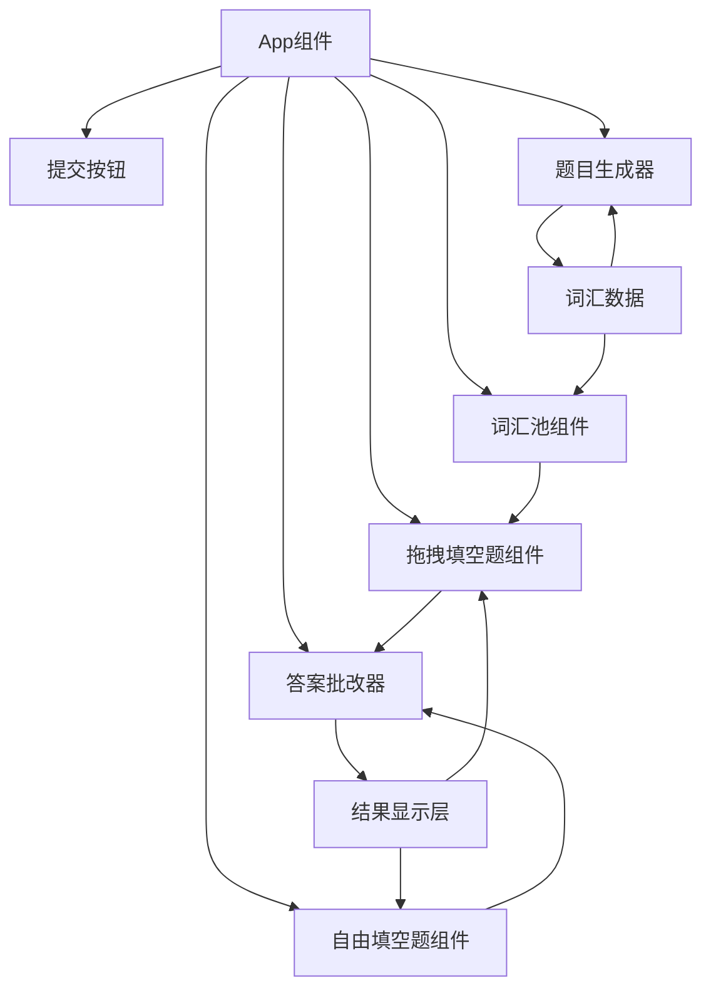
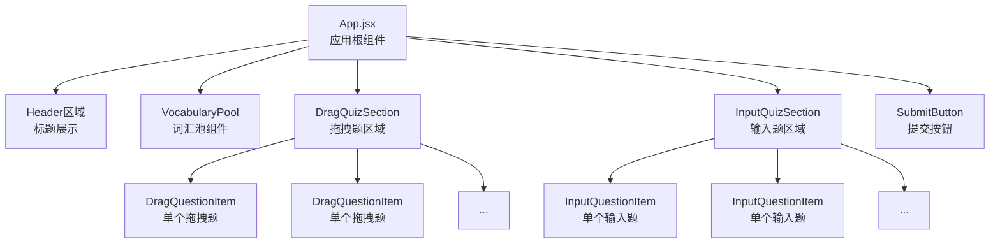
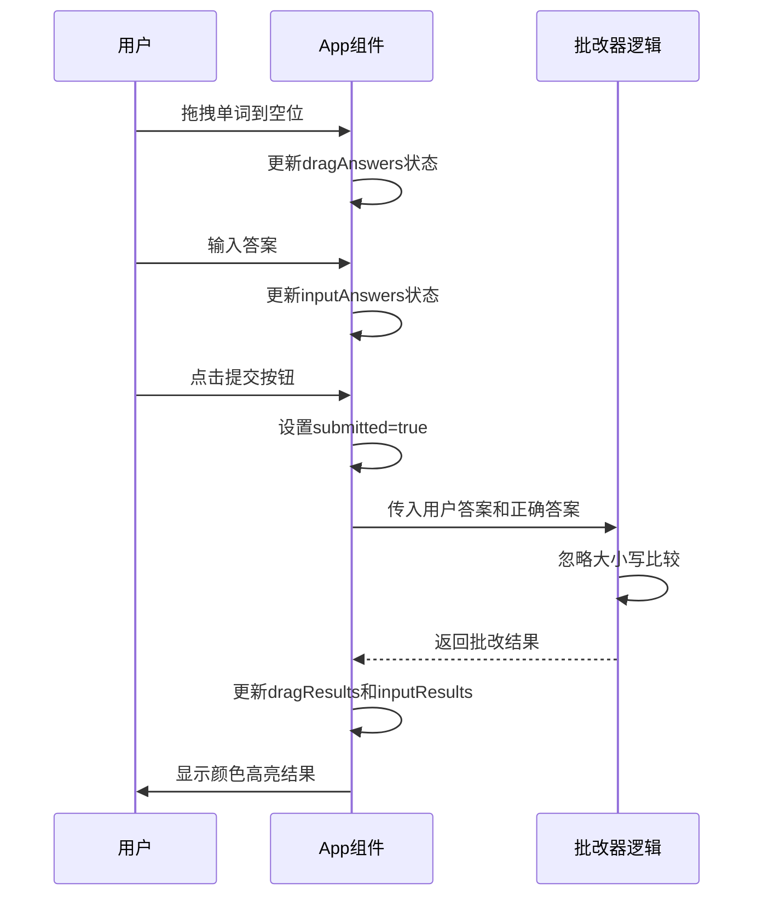
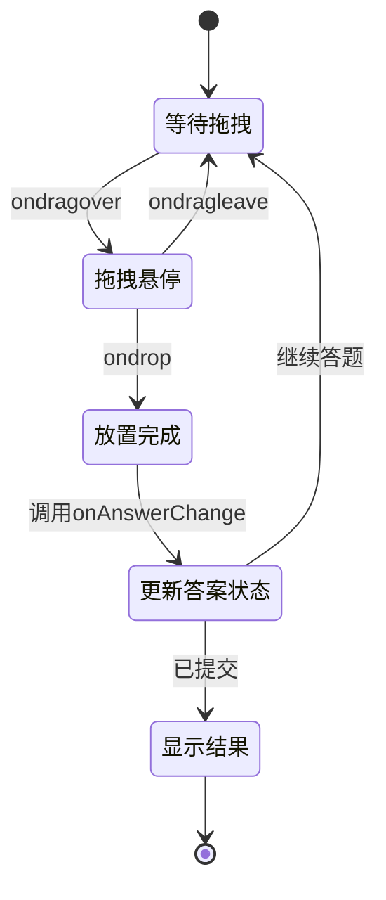
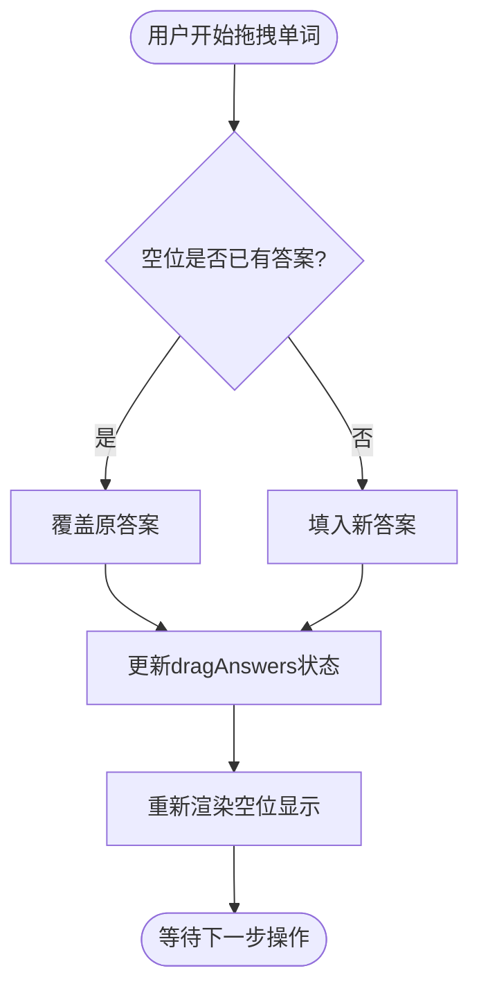
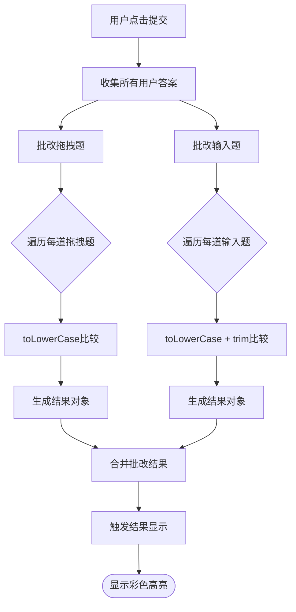
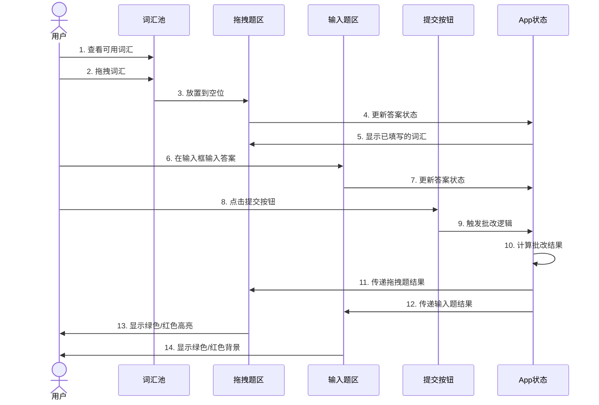
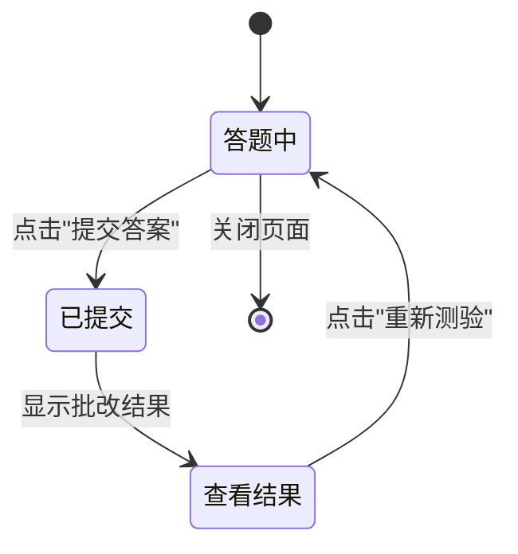
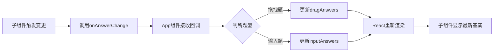
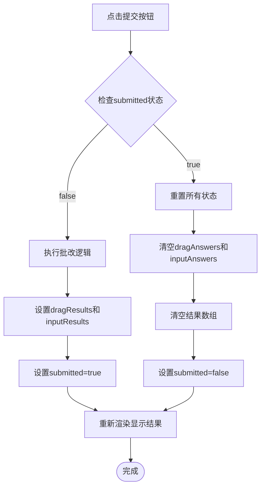

# 英语词汇测验网站设计文档

## 1. 项目概述

### 1.1 项目背景
基于现有的 React + Vite 项目架构，创建一个交互式英语词汇测验网站，帮助用户通过拖拽和手动输入两种方式学习和测试词汇。

### 1.2 核心价值
- 提供互动式词汇学习体验
- 支持即时反馈和自动批改
- 降低词汇学习的心理负担，通过游戏化的拖拽交互提升参与度

### 1.3 技术栈
- 前端框架：React 19.1.1
- 构建工具：Vite 7.1.7
- 开发语言：JavaScript (JSX)
- 样式方案：CSS-in-JS (内联样式)

## 2. 功能架构

### 2.1 系统架构图



### 2.2 核心模块说明

| 模块名称 | 职责描述 | 依赖关系 |
|---------|---------|---------|
| 词汇数据模块 | 存储20个词汇及其对应的题目和答案 | 无 |
| 题目生成器 | 基于词汇列表生成两种题型的题目 | 词汇数据模块 |
| 词汇池组件 | 展示可拖拽的词汇列表 | 词汇数据模块 |
| 拖拽填空题组件 | 渲染拖拽题目并处理拖放交互 | 词汇池组件、题目生成器 |
| 自由填空题组件 | 渲染输入框题目并收集用户输入 | 题目生成器 |
| 答案批改器 | 验证答案并生成反馈结果 | 拖拽填空题组件、自由填空题组件 |
| 结果显示层 | 根据批改结果高亮显示对错 | 答案批改器 |

## 3. 数据模型设计

### 3.1 词汇数据结构

| 字段名 | 数据类型 | 说明 | 示例 |
|-------|---------|------|------|
| word | String | 词汇单词 | "beacon" |
| dragQuestion | String | 拖拽题目句子 | "The lighthouse served as a ____ for ships at sea." |
| dragAnswer | String | 拖拽题正确答案 | "beacon" |
| inputQuestion | String | 输入题目句子 | "In the dark, the ____ guided the lost travelers." |
| inputAnswer | String | 输入题正确答案 | "beacon" |

### 3.2 用户答案数据结构

**拖拽题答案格式：**

| 字段名 | 数据类型 | 说明 |
|-------|---------|------|
| questionIndex | Number | 题目索引 |
| userAnswer | String \| null | 用户拖拽的单词 |
| correctAnswer | String | 正确答案 |
| isCorrect | Boolean | 是否正确 |

**输入题答案格式：**

| 字段名 | 数据类型 | 说明 |
|-------|---------|------|
| questionIndex | Number | 题目索引 |
| userInput | String | 用户输入内容 |
| correctAnswer | String | 正确答案 |
| isCorrect | Boolean | 是否正确 |

### 3.3 词汇列表及题目数据

基于提供的20个词汇，每个词汇生成一道拖拽题和一道输入题：

| 词汇 | 拖拽题目 | 输入题目 |
|-----|---------|---------|
| beacon | The lighthouse served as a ____ for ships at sea. | In the dark, the ____ guided the lost travelers. |
| berserk | The warrior went ____ when he saw his fallen comrades. | The crowd went ____ after the controversial decision. |
| celestial | Astronomers study ____ bodies like stars and planets. | The night sky was filled with ____ beauty. |
| chasten | The harsh criticism served to ____ his arrogance. | The defeat will ____ the overconfident team. |
| confiscate | Airport security will ____ any prohibited items. | Teachers may ____ phones during class time. |
| data | Scientists collect ____ to support their hypothesis. | The survey gathered valuable ____ about consumer habits. |
| detract | Poor lighting can ____ from the beauty of the painting. | His rude behavior did not ____ from his achievements. |
| encounter | Explorers often ____ unexpected challenges in the wilderness. | I hope to ____ interesting people on my travels. |
| epic | The poet composed an ____ tale of heroic deeds. | The film was an ____ story spanning generations. |
| pantomime | The actor used ____ to express emotions without words. | Children enjoy performing ____ at parties. |
| pessimist | A ____ always expects the worst outcome. | Don't be such a ____ about the weather forecast. |
| precaution | Wearing a helmet is a necessary ____ when cycling. | Taking a ____ can prevent future problems. |
| prosecute | The state will ____ anyone who breaks this law. | Authorities decided to ____ the corrupt officials. |
| puncture | A sharp nail can ____ a car tire easily. | Be careful not to ____ the balloon with that pin. |
| retaliate | The nation threatened to ____ against the attack. | He chose not to ____ despite the insult. |
| sham | The trial was exposed as a complete ____. | His concern for others was just a ____. |
| uncouth | His ____ manners offended the dinner guests. | The ____ behavior was unacceptable at the ceremony. |
| underscore | The incident will ____ the need for better safety measures. | The results ____ the importance of education. |
| wholesome | The farm provides ____ food for the community. | She promotes a ____ lifestyle for children. |
| wistful | She cast a ____ glance at her childhood home. | His ____ smile revealed his nostalgia. |

## 4. 组件架构设计

### 4.1 组件层级关系



### 4.2 组件职责定义

#### 4.2.1 App组件（根组件）

**职责：**
- 管理全局状态（用户答案、批改结果、提交状态）
- 协调各子组件间的数据流
- 处理提交逻辑和答案批改

**状态管理：**

| 状态名 | 类型 | 初始值 | 说明 |
|-------|------|--------|------|
| dragAnswers | Object | {} | 存储拖拽题答案，key为题目索引 |
| inputAnswers | Object | {} | 存储输入题答案，key为题目索引 |
| submitted | Boolean | false | 是否已提交 |
| dragResults | Array | [] | 拖拽题批改结果 |
| inputResults | Array | [] | 输入题批改结果 |

**核心逻辑流程：**



#### 4.2.2 VocabularyPool组件（词汇池）

**职责：**
- 展示所有可拖拽的词汇
- 实现拖拽源功能

**Props接口：**

| Prop名称 | 类型 | 必需 | 说明 |
|---------|------|------|------|
| vocabularyList | Array<String> | 是 | 词汇数组 |

**交互行为：**
- 每个词汇单词设置为可拖拽（draggable=true）
- 拖拽开始时，存储被拖拽的单词到dataTransfer对象
- 视觉反馈：拖拽时单词透明度降低

#### 4.2.3 DragQuizSection组件（拖拽题区域）

**职责：**
- 渲染所有拖拽填空题
- 处理放置目标的拖放事件
- 显示批改结果

**Props接口：**

| Prop名称 | 类型 | 必需 | 说明 |
|---------|------|------|------|
| questions | Array<Object> | 是 | 题目数组 |
| answers | Object | 是 | 用户答案对象 |
| onAnswerChange | Function | 是 | 答案变更回调 |
| submitted | Boolean | 是 | 是否已提交 |
| results | Array | 否 | 批改结果数组 |

**拖放交互流程：**



**空位样式规则：**

| 状态 | 背景色 | 边框 | 文本颜色 |
|------|--------|------|---------|
| 未填写 | 白色 | 虚线下划线 | 无 |
| 已填写（未提交） | 浅灰色 | 实线边框 | 黑色 |
| 正确（已提交） | 浅绿色 | 绿色边框 | 绿色 |
| 错误（已提交） | 浅红色 | 红色边框 | 红色 |

#### 4.2.4 InputQuizSection组件（输入题区域）

**职责：**
- 渲染所有输入填空题
- 收集用户输入
- 显示批改结果

**Props接口：**

| Prop名称 | 类型 | 必需 | 说明 |
|---------|------|------|------|
| questions | Array<Object> | 是 | 题目数组 |
| answers | Object | 是 | 用户答案对象 |
| onAnswerChange | Function | 是 | 答案变更回调 |
| submitted | Boolean | 是 | 是否已提交 |
| results | Array | 否 | 批改结果数组 |

**输入框样式规则：**

| 状态 | 背景色 | 边框 | 说明文本 |
|------|--------|------|---------|
| 未填写 | 白色 | 灰色边框 | 无 |
| 已填写（未提交） | 白色 | 蓝色边框 | 无 |
| 正确（已提交） | 浅绿色 | 绿色边框 | 无 |
| 错误（已提交） | 浅红色 | 红色边框 | 显示正确答案 |

#### 4.2.5 SubmitButton组件（提交按钮）

**职责：**
- 触发答案提交
- 根据状态显示不同文本

**Props接口：**

| Prop名称 | 类型 | 必需 | 说明 |
|---------|------|------|------|
| onSubmit | Function | 是 | 提交回调函数 |
| submitted | Boolean | 是 | 是否已提交 |

**按钮状态：**

| 状态 | 按钮文本 | 是否可点击 | 背景色 |
|------|---------|-----------|--------|
| 未提交 | "提交答案" | 是 | 橙色 |
| 已提交 | "重新测验" | 是 | 灰色 |

## 5. 业务逻辑设计

### 5.1 拖拽交互逻辑

**拖拽源（词汇池中的单词）行为：**

1. 设置draggable属性为true
2. 监听dragstart事件：将单词文本存入event.dataTransfer.setData('text', word)
3. 拖拽期间添加视觉反馈（透明度变化）

**放置目标（句子空位）行为：**

1. 监听dragover事件：调用event.preventDefault()以允许放置
2. 监听drop事件：
   - 调用event.preventDefault()阻止默认行为
   - 从event.dataTransfer.getData('text')获取单词
   - 调用父组件的onAnswerChange回调，更新答案状态
3. 悬停时添加视觉提示（边框高亮）

**状态流转：**



### 5.2 答案批改逻辑

**批改规则定义：**

1. **大小写处理**：将用户答案和正确答案统一转换为小写后比较
2. **空值处理**：未填写的题目标记为错误
3. **字符串匹配**：去除首尾空格后进行完全匹配

**批改流程：**



**批改结果对象结构：**

```
{
  questionIndex: 题目索引,
  userAnswer: 用户答案原文,
  correctAnswer: 正确答案,
  isCorrect: 是否正确（布尔值）,
  normalizedUserAnswer: 标准化后的用户答案（小写、去空格）
}
```

### 5.3 结果显示逻辑

**拖拽题结果展示规则：**

- **正确**：空位内文字显示为绿色，背景为浅绿色
- **错误**：空位内文字显示为红色，背景为浅红色，空位后追加显示"（正确答案：xxx）"

**输入题结果展示规则：**

- **正确**：输入框背景变为浅绿色，边框为绿色
- **错误**：输入框背景变为浅红色，边框为红色，输入框下方显示"正确答案：xxx"

**视觉反馈色彩方案：**

| 元素 | 正确颜色 | 错误颜色 | 中性颜色 |
|------|---------|---------|---------|
| 背景色 | #d4edda | #f8d7da | #ffffff |
| 边框色 | #28a745 | #dc3545 | #ced4da |
| 文字色 | #155724 | #721c24 | #333333 |

## 6. 用户交互流程

### 6.1 完整答题流程



### 6.2 重新测验流程

当用户提交答案后，可以选择重新测验：



重新测验时需要重置的状态：
- dragAnswers清空为{}
- inputAnswers清空为{}
- submitted设为false
- dragResults清空为[]
- inputResults清空为[]

## 7. 样式设计规范

### 7.1 整体布局

**页面布局结构：**

| 区域 | 宽度 | 对齐方式 | 内边距 | 外边距 |
|------|------|---------|--------|--------|
| 整体容器 | 最大1200px | 居中 | 20px | 20px自动 |
| 标题区 | 100% | 居中 | 20px 0 | 0 0 30px 0 |
| 词汇池 | 100% | 左对齐 | 15px | 0 0 30px 0 |
| 题目区 | 100% | 左对齐 | 20px | 0 0 20px 0 |
| 提交按钮 | 200px | 居中 | 12px 24px | 30px 自动 |

### 7.2 词汇池样式规范

**容器样式：**
- 背景色：浅灰色（#f5f5f5）
- 边框：1px实线，灰色（#ddd）
- 圆角：8px
- 内边距：15px

**词汇单词样式：**
- 显示方式：内联块（inline-block）
- 背景色：白色
- 边框：1px实线，灰色（#ccc）
- 圆角：4px
- 内边距：8px 12px
- 外边距：5px
- 光标：移动图标（move）
- 字体大小：14px
- 拖拽时透明度：0.5

### 7.3 题目样式规范

**题目容器：**
- 外边距：0 0 15px 0
- 行高：1.8

**题目编号：**
- 字体粗细：加粗
- 颜色：深灰色（#555）

**空位（拖拽题）样式：**
- 最小宽度：100px
- 显示方式：内联块
- 内边距：4px 8px
- 边框底部：2px虚线，灰色（未填写时）
- 边框底部：2px实线（已填写时）
- 背景色：根据状态变化

**输入框（输入题）样式：**
- 宽度：150px
- 内边距：6px 10px
- 边框：1px实线
- 圆角：4px
- 字体大小：14px
- 背景色：根据状态变化

**正确答案提示样式：**
- 颜色：深红色（#721c24）
- 字体大小：12px
- 左边距：8px（拖拽题）
- 上边距：5px（输入题）

### 7.4 提交按钮样式规范

**按钮样式：**
- 背景色：橙色（#ff8c42）（未提交）/ 灰色（#6c757d）（已提交）
- 文字颜色：白色
- 边框：无
- 圆角：6px
- 内边距：12px 24px
- 字体大小：16px
- 字体粗细：加粗
- 光标：指针
- 过渡效果：背景色0.3秒

**悬停效果：**
- 未提交时背景色：深橙色（#e67a31）
- 已提交时背景色：深灰色（#5a6268）

### 7.5 色彩禁用规范

根据要求，禁止使用蓝紫色系（包括但不限于）：
- 蓝色（#0000ff及其衍生色）
- 紫色（#800080及其衍生色）
- 靛蓝色（#4b0082及其衍生色）

## 8. 状态管理策略

### 8.1 状态分类

| 状态类型 | 存储位置 | 更新频率 | 持久化 |
|---------|---------|---------|--------|
| 题目数据 | 组件内常量 | 不变 | 否 |
| 用户答案 | App组件state | 每次答题 | 否 |
| 批改结果 | App组件state | 每次提交 | 否 |
| 提交状态 | App组件state | 提交/重置时 | 否 |

### 8.2 状态更新流程

**答案更新流程：**



**提交状态更新流程：**



## 9. 错误处理与边界情况

### 9.1 边界情况处理

| 场景 | 处理策略 |
|------|---------|
| 用户未填写所有题目就提交 | 允许提交，未填写题目标记为错误 |
| 拖拽时鼠标移出窗口 | 取消拖拽操作，不影响已有答案 |
| 用户在输入框输入空格 | 批改时自动去除首尾空格 |
| 重复拖拽同一个词汇 | 允许重复使用，每个词汇可用于多个空位 |
| 快速连续点击提交按钮 | 按钮状态控制，避免重复处理 |

### 9.2 数据验证规则

**拖拽题验证：**
- 检查用户答案是否为非空字符串
- 检查是否存在于词汇列表中（可选，增强健壮性）

**输入题验证：**
- 去除首尾空格后进行验证
- 空字符串视为未作答

### 9.3 用户反馈机制

**交互反馈：**

| 用户操作 | 视觉反馈 | 反馈时机 |
|---------|---------|---------|
| 拖拽开始 | 单词透明度降低 | 拖拽进行中 |
| 拖拽悬停在空位 | 空位边框高亮 | 鼠标悬停时 |
| 成功放置单词 | 空位显示单词，背景变化 | 放置完成后 |
| 输入文字 | 输入框边框变蓝 | 获得焦点时 |
| 提交答案 | 全部题目显示颜色高亮 | 提交完成后 |

## 10. 性能优化考虑

### 10.1 渲染优化策略

**优化点：**

1. **避免不必要的重渲染**
   - 使用React.memo包裹静态组件（如词汇池）
   - 仅在答案变更时更新对应题目组件

2. **事件处理优化**
   - 拖拽事件回调使用useCallback缓存
   - 输入框onChange使用防抖处理（可选）

3. **数据结构优化**
   - 使用对象而非数组存储答案，提高查找效率
   - 题目索引作为key，避免数组遍历

### 10.2 用户体验优化

**加载体验：**
- 所有数据内嵌在组件中，无需异步加载
- 首屏即可完整展示所有内容

**交互流畅性：**
- 拖拽操作提供即时视觉反馈
- 批改结果立即显示，无延迟

## 11. 测试策略

### 11.1 功能测试点

| 测试项 | 测试内容 | 预期结果 |
|-------|---------|---------|
| 词汇池展示 | 页面加载后显示所有20个词汇 | 词汇池中显示完整词汇列表 |
| 拖拽功能 | 从词汇池拖拽单词到空位 | 空位显示拖拽的单词 |
| 重复拖拽 | 同一单词拖拽到多个空位 | 每个空位都能正常接受 |
| 覆盖答案 | 拖拽新单词到已有答案的空位 | 旧答案被新答案替换 |
| 输入功能 | 在输入框中输入单词 | 输入框正常接受输入 |
| 大小写忽略 | 输入"Beacon"，正确答案为"beacon" | 批改为正确 |
| 空格处理 | 输入" beacon " | 批改为正确 |
| 未作答处理 | 部分题目未作答就提交 | 未作答题目标记为错误 |
| 结果显示 | 提交后查看批改结果 | 正确题目绿色，错误题目红色 |
| 重新测验 | 点击重新测验按钮 | 所有答案清空，可重新作答 |

### 11.2 兼容性测试

**浏览器兼容性：**
- Chrome（最新版）
- Firefox（最新版）
- Safari（最新版）
- Edge（最新版）

**拖放API兼容性：**
- 确保HTML5 Drag and Drop API在目标浏览器中正常工作
- 测试触摸设备的拖拽行为（移动端可能需要额外处理）

## 12. 扩展性设计

### 12.1 未来可扩展功能

| 功能点 | 扩展方向 | 实现建议 |
|-------|---------|---------|
| 题目导入 | 支持从外部JSON文件导入题目 | 添加数据加载模块 |
| 进度保存 | 自动保存答题进度到localStorage | 添加状态持久化层 |
| 计时功能 | 显示答题用时 | 添加Timer组件 |
| 分数统计 | 显示正确率和得分 | 添加Score组件 |
| 难度分级 | 根据词汇难度分组题目 | 题目数据添加difficulty字段 |
| 音频发音 | 点击单词播放发音 | 集成Web Speech API或音频资源 |
| 提示功能 | 提供首字母提示或词义提示 | 添加Hint组件 |

### 12.2 架构可扩展性

**组件解耦：**
- 词汇数据与组件逻辑分离，便于切换数据源
- 批改逻辑独立为工具函数，便于单元测试和复用

**样式可配置：**
- 色彩方案可抽取为主题配置对象
- 布局尺寸可提取为常量配置

**多语言支持：**
- UI文案可抽取为i18n资源文件
- 支持中英文界面切换
