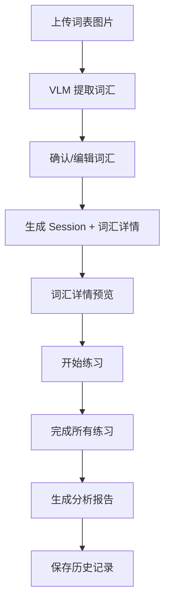
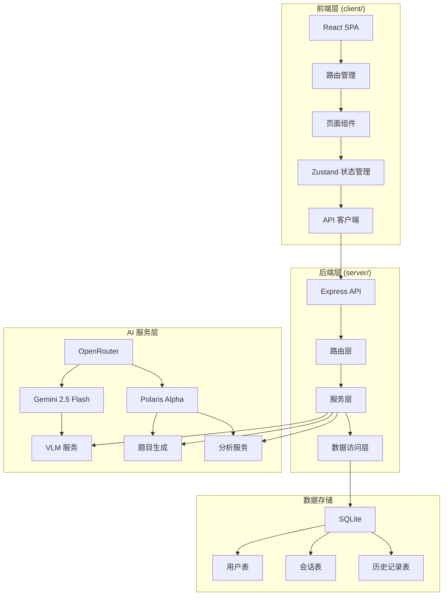
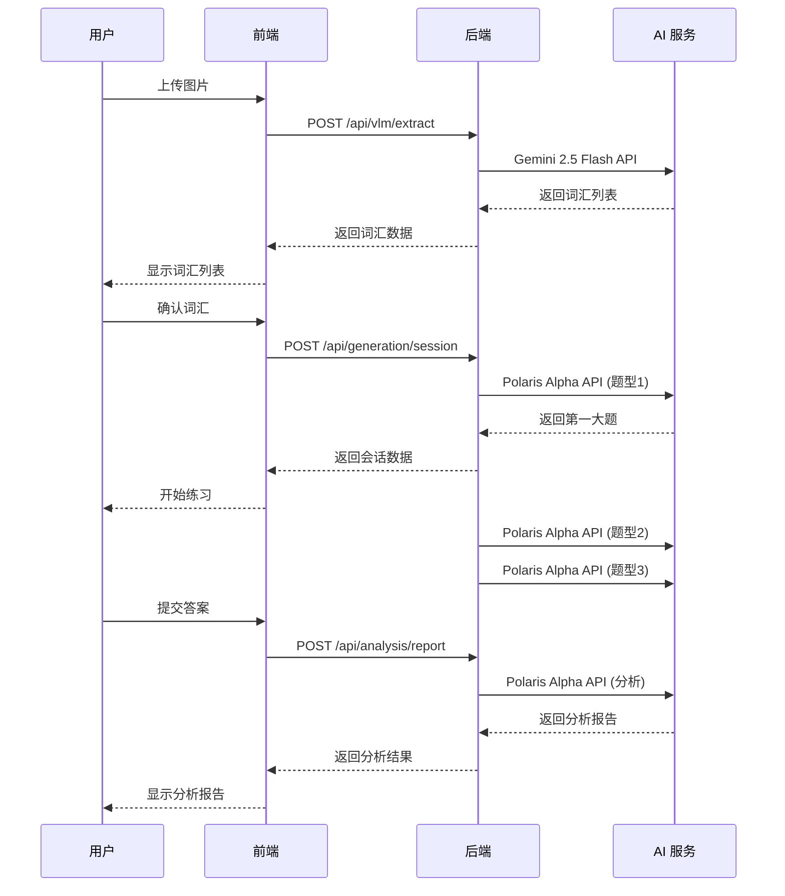

# AI 词汇训练平台

> 🚀 一个完全由 AI 实时驱动的词汇训练应用：上传单词表图片，Gemini 2.5 Flash 读取词汇，Polaris Alpha 生成 3 大题型的"超级 JSON"，并在练习结束后用中文输出分析报告。

[](https://reactjs.org/)
[](https://www.typescriptlang.org/)
[](https://expressjs.com/)
[](https://openrouter.ai/)
[](https://www.sqlite.org/)

## 📋 目录

- [项目概述](#项目概述)
- [核心特性](#核心特性)
- [技术栈](#技术栈)
- [快速开始](#快速开始)
- [配置说明](#配置说明)
- [使用指南](#使用指南)
- [API 参考](#api-参考)
- [架构设计](#架构设计)
- [开发者指南](#开发者指南)
- [故障排除](#故障排除)
- [版本历史](#版本历史)
- [贡献指南](#贡献指南)
- [许可证](#许可证)

## 项目概述

### 产品定位

这是一个 AI 驱动的词汇练习平台，通过以下流程提供智能化的词汇训练体验：

1. **VLM 识别**：用户上传词表图片，系统使用 Google Gemini 2.5 Flash 提取词汇
2. **AI 生成**：基于提取的词汇，使用 OpenRouter 的 Polaris Alpha 模型生成三大题型的练习题
3. **智能练习**：用户完成词汇练习，系统记录答题过程
4. **中文分析**：练习结束后，AI 生成中文分析报告和个性化建议

### 适用场景

- 📚 **语言学习者**：英语、日语等外语词汇记忆
- 👨‍🏫 **教育工作者**：快速生成词汇测试题目
- 🏫 **培训机构**：批量处理学员词汇表并生成练习
- 💼 **企业培训**：专业术语词汇考核

## 核心特性

### 🤖 AI 驱动的完整流程

- **智能图片识别**：支持多张图片上传，自动提取词汇列表
- **动态题库生成**：基于词汇智能生成 3 大题型，每种题型可自定义题目数量
- **实时进度追踪**：分段生成题库，用户可立即开始练习第一大题
- **中文智能分析**：练习结束后生成 100 字左右的中文分析报告

### 🎯 三大题型设计

1. **英译中选择题**：给出英文单词，选择正确的中文释义
2. **中译英选择题**：给出中文释义，选择正确的英文单词
3. **句子填空题**：在句子中填入合适的词汇，支持智能遮挡

### 📖 词汇详情预览

- 选择难度后立即并行生成题库 Session 与词汇详情，确保词性、全部中文释义与双语例句一应俱全
- 例句默认折叠，展开后展示英文原句 + 中文翻译，方便对照记忆
- 页面顶部复用题库进度胶囊，任何人必须阅读该页并点击“开始练习”才可进入三大题

### 💾 双模式数据管理

- **游客模式**：数据保存在浏览器 LocalStorage，最多保存 12 条记录
- **登录模式**：数据保存在 SQLite 数据库，支持多设备同步

### 🔄 Session 化分段生成

- **即时开始**：只需等待第一大题生成完成即可开始练习
- **后台生成**：其余题型在后台串行生成，用户可实时查看进度
- **智能重试**：支持单个题型失败重试，不影响已完成的题目

## 技术栈

### 前端技术

| 技术 | 版本 | 说明 |
|------|------|------|
| React | 19.1.1 | 前端框架 |
| TypeScript | 5.9.3 | 类型安全 |
| Vite | 7.1.7 | 构建工具 |
| React Router | 7.9.5 | 路由管理 |
| Zustand | 5.0.8 | 状态管理 |
| Axios | 1.13.2 | HTTP 客户端 |
| Lucide React | 0.552.0 | 图标库 |

### 后端技术

| 技术 | 版本 | 说明 |
|------|------|------|
| Node.js | 18+ | 运行环境 |
| Express | 5.1.0 | Web 框架 |
| TypeScript | 5.9.3 | 类型安全 |
| SQLite | 12.4.1 | 数据库 |
| OpenRouter | - | AI 模型接口 |
| Zod | 4.1.12 | 数据验证 |
| Winston | 3.18.3 | 日志管理 |

### AI 模型

| 模型 | 用途 | 特点 |
|------|------|------|
| `google/gemini-2.5-flash-preview-09-2025` | 图片词汇提取 | 高精度 VLM 模型 |
| `openrouter/polaris-alpha` | 题目生成与分析 | 多模型降级策略 |

## 快速开始

### 环境要求

- Node.js 18+
- npm 或 yarn
- OpenRouter API Key

### 1. 克隆项目

```bash
git clone <repository-url>
cd vocab-trainer
```

### 2. 安装依赖

```bash
# 安装根目录依赖
npm install

# 依赖会自动安装 client/ 和 server/ 的工作区
```

### 3. 环境配置

复制环境变量模板：

```bash
cp .env.example .env
```

编辑 `.env` 文件，配置必要的环境变量：

```env
# OpenRouter 配置
OPENROUTER_API_KEY=sk-or-v1-your-key-here
OPENROUTER_APP_TITLE=AI Vocab Trainer
OPENROUTER_REFERER=http://localhost:5173
OPENROUTER_PROXY=http://127.0.0.1:7890

# 应用配置
VITE_MAX_VLM_IMAGES=5
PORT=4000
CLIENT_ORIGINS=http://localhost:5173,http://localhost:5174
JWT_SECRET=replace-with-strong-secret
DATABASE_PATH=./storage/vocab.db
VITE_API_BASE_URL=http://localhost:4000/api
```

### 4. 启动开发环境

```bash
# 同时启动前端和后端
npm run dev
```

访问应用：
- 前端：http://localhost:5173
- 后端 API：http://localhost:4000

### 5. 生产构建

```bash
# 构建前端和后端
npm run build

# 启动生产服务器
npm start
```

## 配置说明

### 环境变量详解

#### OpenRouter 配置

| 变量 | 必需 | 默认值 | 说明 |
|------|------|--------|------|
| `OPENROUTER_API_KEY` | ✅ | - | OpenRouter API 密钥 |
| `OPENROUTER_APP_TITLE` | ❌ | AI Vocab Trainer | 应用标题 |
| `OPENROUTER_REFERER` | ❌ | http://localhost:5173 | Referer 头 |
| `OPENROUTER_PROXY` | ❌ | - | 代理服务器地址 |

#### 应用配置

| 变量 | 必需 | 默认值 | 说明 |
|------|------|--------|------|
| `PORT` | ❌ | 4000 | 后端服务端口 |
| `CLIENT_ORIGINS` | ❌ | http://localhost:5173 | 允许的前端域名 |
| `JWT_SECRET` | ✅ | - | JWT 签名密钥 |
| `DATABASE_PATH` | ❌ | ./storage/vocab.db | SQLite 数据库路径 |
| `VITE_API_BASE_URL` | ❌ | http://localhost:4000/api | API 基础路径 |
| `VITE_MAX_VLM_IMAGES` | ❌ | 5 | 最大上传图片数量 |

### 代理配置

对于中国大陆用户，需要配置代理访问 OpenRouter：

```env
OPENROUTER_PROXY=http://127.0.0.1:7890
```

确保代理服务器正在运行（如 Clash、V2Ray 等）。

## 使用指南

### 基本工作流程



### 1. 上传词表图片

支持格式：JPG、PNG、WebP
最大数量：5 张图片（可配置）
推荐清晰度：300 DPI 以上

### 2. 确认词汇列表

- 系统会自动去重和清理格式
- 可手动添加、删除或编辑词汇
- 支持批量导入（粘贴文本）

### 3. 触发题库与词汇详情生成

选择难度级别后，会同时触发题库 Session 与词汇详情生成流程：
- **Session**：立即生成第一大题并返回 sessionId，第二、三大题在后台轮询
- **词典视图**：同一批词汇会调用 OpenRouter 模型生成词性、释义与双语例句

可选难度：
- **Beginner**：基础词汇，简单题目
- **Intermediate**：中级词汇，适中难度
- **Advanced**：高级词汇，复杂题目

### 4. 预览词汇详情页面

- 必经步骤，逐词校对单词、词性、中文释义与双语例句
- 例句默认收起，展开后可看到英文原句 + 中文翻译
- 顶部展示题库生成进度，若某一大题失败可直接重试
- 词典生成失败时可在页面内重新触发，无需回到上一页

### 5. 开始练习

- 完成词典预览并点击“开始练习”后进入答题界面
- 严格按照 1→2→3 的顺序作答，每题限时，无法回退
- 继续显示题库生成进度与状态，支持对未完成题型进行重试

### 6. 查看分析报告

练习结束后会显示：
- 答题正确率
- 弱点词汇分析
- 个性化学习建议
- 错题强化选项

## API 参考

### 基础信息

- **Base URL**: `http://localhost:4000/api`
- **Content-Type**: `application/json`
- **认证方式**: JWT Bearer Token

### 认证接口

#### 用户注册

```http
POST /api/auth/register
```

**请求体**：
```json
{
  "email": "user@example.com",
  "password": "password123"
}
```

**响应**：
```json
{
  "user": {
    "id": "uuid",
    "email": "user@example.com",
    "created_at": "2024-01-01T00:00:00.000Z"
  },
  "token": "jwt-token"
}
```

#### 用户登录

```http
POST /api/auth/login
```

**请求体**：
```json
{
  "email": "user@example.com",
  "password": "password123"
}
```

**响应**：
```json
{
  "user": {
    "id": "uuid",
    "email": "user@example.com",
    "created_at": "2024-01-01T00:00:00.000Z"
  },
  "token": "jwt-token"
}
```

#### 获取当前用户

```http
GET /api/auth/me
Authorization: Bearer your-jwt-token
```

**响应**：
```json
{
  "user": {
    "id": "uuid",
    "email": "user@example.com",
    "created_at": "2024-01-01T00:00:00.000Z"
  }
}
```

### VLM 接口

#### 提取图片中的词汇

```http
POST /api/vlm/extract
```

**请求体**：
```json
{
  "images": [
    "data:image/png;base64,iVBORw0KGgoAAAANSUhEUgAA..."
  ]
}
```

**响应**：
```json
{
  "words": ["vocabulary", "learning", "ai"]
}
```

**限制**：
- 最大图片数量：5 张
- 图片格式：Base64 编码的 PNG、JPG、WebP
- 单次请求最大词汇量：1000 个

### 题目生成接口

#### 创建生成会话（推荐）

```http
POST /api/generation/session
```

**请求体**：
```json
{
  "words": ["vocabulary", "learning", "ai"],
  "difficulty": "intermediate",
  "questionCountPerType": 10
}
```

**响应**：
```json
{
  "sessionId": "session-uuid",
  "status": "generating",
  "progress": {
    "type_1": "completed",
    "type_2": "pending",
    "type_3": "pending"
  },
  "questions_type_1": [
    {
      "id": "q1",
      "question": "What is the Chinese meaning of 'vocabulary'?",
      "choices": [...],
      "answer": "词汇"
    }
  ]
}
```

#### 查询会话状态

```http
GET /api/generation/session/:sessionId
```

**响应**：
```json
{
  "sessionId": "session-uuid",
  "status": "completed",
  "progress": {
    "type_1": "completed",
    "type_2": "completed", 
    "type_3": "completed"
  },
  "questions_type_1": [...],
  "questions_type_2": [...],
  "questions_type_3": [...]
}
```

#### 重试生成

```http
POST /api/generation/session/:sessionId/retry
```

**请求体**：
```json
{
  "type": "questions_type_2"
}
```

#### 词汇详情生成

```http
POST /api/generation/details
```

**请求体**：
```json
{
  "words": ["abandon", "meticulous", "render"],
  "difficulty": "intermediate"
}
```

**响应**：
```json
{
  "details": [
    {
      "word": "abandon",
      "partsOfSpeech": ["verb"],
      "definitions": ["放弃；抛弃", "沉溺于某个行为或情绪"],
      "examples": [
        {
          "en": "She abandoned the project halfway through.",
          "zh": "她在进行到一半时就放弃了这个项目。"
        }
      ]
    }
  ]
}
```

接口与 Session 并行调用，服务端会使用多模型降级策略生成词性、中文释义和双语例句，前端词典页面读取该结果。

#### 传统方式（兼容）

```http
POST /api/generation/super-json
```

**请求体**：
```json
{
  "words": ["vocabulary", "learning", "ai"],
  "difficulty": "intermediate",
  "questionCountPerType": 10
}
```

### 分析接口

#### 生成练习分析报告

```http
POST /api/analysis/report
```

**请求体**：
```json
{
  "difficulty": "intermediate",
  "words": ["vocabulary", "learning", "ai"],
  "answers": [
    {
      "questionId": "q1",
      "choiceId": "c1",
      "correct": true,
      "elapsedMs": 2500
    }
  ],
  "superJson": {...},
  "score": 85.5
}
```

**响应**：
```json
{
  "report": "您的词汇掌握情况总体良好，正确率为85.5%...",
  "recommendations": [
    "加强对动词短语的练习",
    "注意时态变化的词汇变形"
  ]
}
```

### 历史接口

#### 保存练习记录

```http
POST /api/history
Authorization: Bearer your-jwt-token
```

**请求体**：
```json
{
  "difficulty": "intermediate",
  "words": ["vocabulary", "learning", "ai"],
  "superJson": {...},
  "answers": [...],
  "score": 85.5,
  "analysis": {...}
}
```

#### 获取历史记录列表

```http
GET /api/history
Authorization: Bearer your-jwt-token
```

**响应**：
```json
[
  {
    "id": "session-uuid",
    "difficulty": "intermediate",
    "score": 85.5,
    "created_at": "2024-01-01T00:00:00.000Z"
  }
]
```

#### 获取单次练习详情

```http
GET /api/history/:id
Authorization: Bearer your-jwt-token
```

## 架构设计

### 整体架构



### 核心组件

#### 前端组件

| 组件 | 路径 | 功能 |
|------|------|------|
| `LandingPage` | `client/src/pages/LandingPage.tsx` | 登录/注册页面 |
| `UploadPage` | `client/src/pages/UploadPage.tsx` | 图片上传页面 |
| `ConfirmWordsPage` | `client/src/pages/ConfirmWordsPage.tsx` | 词汇确认页面 |
| `QuizPage` | `client/src/pages/QuizPage.tsx` | 练习题目页面 |
| `ReportPage` | `client/src/pages/ReportPage.tsx` | 分析报告页面 |
| `HistoryPage` | `client/src/pages/HistoryPage.tsx` | 历史记录页面 |

#### 后端服务

| 服务 | 路径 | 功能 |
|------|------|------|
| `vlm.ts` | `server/src/services/vlm.ts` | VLM 图片识别服务 |
| `superGenerator.ts` | `server/src/services/superGenerator.ts` | 题目生成服务 |
| `analysis.ts` | `server/src/services/analysis.ts` | 分析报告服务 |
| `auth.ts` | `server/src/services/auth.ts` | 认证服务 |
| `openrouter.ts` | `server/src/services/openrouter.ts` | OpenRouter API 客户端 |

### 数据流设计



## 开发者指南

### 开发环境设置

#### 1. 代码规范

项目使用以下工具确保代码质量：

```bash
# 检查前端代码
npm run lint --workspace=client

# 检查后端类型
npm run typecheck --workspace=server

# 全栈开发
npm run dev
```

#### 2. 项目结构

```
vocab-trainer/
├── client/                 # 前端应用
│   ├── src/
│   │   ├── pages/         # 页面组件
│   │   ├── components/    # 共享组件
│   │   ├── store/         # Zustand 状态管理
│   │   ├── lib/           # 工具库
│   │   └── types/         # 类型定义
│   └── package.json
├── server/                 # 后端 API
│   ├── src/
│   │   ├── routes/        # API 路由
│   │   ├── services/      # 业务服务
│   │   ├── db/            # 数据库
│   │   └── middleware/    # 中间件
│   └── package.json
├── .env.example           # 环境变量模板
└── package.json           # 根目录配置
```

#### 3. 状态管理

使用 Zustand 进行状态管理：

```typescript
// 用户认证状态
const useAuthStore = create<AuthState>((set) => ({
  mode: 'unauthenticated',
  user: null,
  token: null,
  // ...
}))

// 练习状态
const usePracticeStore = create<PracticeState>((set) => ({
  words: [],
  superJson: null,
  answers: [],
  // ...
}))
```

### API 开发

#### 添加新的 API 端点

1. **定义路由** (`server/src/routes/`)

```typescript
import { Router } from 'express';
import { asyncHandler } from '../utils/asyncHandler';

const router = Router();

router.get('/example', asyncHandler(async (req, res) => {
  res.json({ message: 'Hello World' });
}));

export default router;
```

2. **添加到主应用** (`server/src/index.ts`)

```typescript
app.use('/api/example', exampleRouter);
```

#### 数据验证

使用 Zod 进行请求验证：

```typescript
import { z } from 'zod';

const payloadSchema = z.object({
  name: z.string().min(1, 'Name is required'),
  email: z.string().email('Invalid email'),
});

router.post('/example', asyncHandler(async (req, res) => {
  const data = payloadSchema.parse(req.body);
  // 处理逻辑
}));
```

### 测试指南

#### 前端测试

```bash
# 运行前端测试
npm test --workspace=client

# 创建组件测试
# client/src/__tests__/ComponentName.spec.tsx
```

#### 后端测试

```bash
# 运行后端测试
npm test --workspace=server

# 创建单元测试
# server/src/__tests__/serviceName.spec.ts
```

#### 手动测试流程

每次代码变更后，请执行以下测试：

1. **启动开发环境**
   ```bash
   npm run dev
   ```

2. **测试完整流程**
   - 上传词表图片
   - 确认词汇列表
   - 生成并完成练习
   - 查看分析报告
   - 检查历史记录

3. **验证代码质量**
   ```bash
   npm run lint --workspace=client
   npm run typecheck --workspace=server
   ```

### 部署指南

#### 开发环境部署

```bash
# 1. 安装依赖
npm install

# 2. 配置环境变量
cp .env.example .env
# 编辑 .env 文件

# 3. 构建应用
npm run build

# 4. 启动服务
npm run dev
```

#### 生产环境部署

```bash
# 1. 构建生产版本
npm run build

# 2. 启动后端服务
cd server && npm start

# 3. 部署前端静态文件
# 使用 Nginx、Apache 或其他静态文件服务器
```

#### Docker 部署

```dockerfile
# 前端 Dockerfile
FROM node:18-alpine
WORKDIR /app
COPY client/package*.json ./
RUN npm install
COPY client/ .
RUN npm run build
EXPOSE 5173
CMD ["npm", "run", "preview"]

# 后端 Dockerfile
FROM node:18-alpine
WORKDIR /app
COPY server/package*.json ./
RUN npm install --production
COPY server/ .
COPY --from=builder /app/dist ./dist
EXPOSE 4000
CMD ["node", "dist/index.js"]
```

## 故障排除

### 常见问题

#### 1. OpenRouter API 连接失败

**问题**：无法访问 OpenRouter API，返回网络错误

**解决方案**：
1. 检查 `OPENROUTER_API_KEY` 是否正确配置
2. 如果在中国大陆，确保代理配置正确：
   ```env
   OPENROUTER_PROXY=http://127.0.0.1:7890
   ```
3. 检查代理服务器是否正常运行

#### 2. VLM 图片识别失败

**问题**：上传图片后无法识别词汇

**解决方案**：
1. 检查图片格式和大小
2. 确保图片清晰度足够
3. 查看服务器日志中的具体错误信息
4. 尝试重新上传或使用其他图片

#### 3. JWT 认证失败

**问题**：登录后无法访问需要认证的接口

**解决方案**：
1. 检查 `JWT_SECRET` 配置是否正确
2. 确认请求头中包含正确的 Authorization
3. 检查 token 是否过期

#### 4. 数据库连接问题

**问题**：无法连接 SQLite 数据库

**解决方案**：
1. 确保 `DATABASE_PATH` 目录存在且有写权限
2. 检查数据库文件是否被其他进程占用
3. 尝试删除数据库文件重新初始化

### 日志调试

启用详细日志：

```bash
# 设置日志级别
export LOG_LEVEL=debug

# 查看实时日志
npm run dev
```

### 性能优化

#### 前端优化

- 使用 React.memo 优化组件渲染
- 实现虚拟滚动处理大量数据
- 启用生产构建压缩

#### 后端优化

- 使用连接池管理数据库连接
- 实现请求缓存
- 优化 AI API 调用频率

### 监控和维护

#### 健康检查

```bash
# 检查后端服务状态
curl http://localhost:4000/health

# 检查前端构建状态
npm run build --dry-run
```

#### 数据备份

```bash
# 备份数据库
cp server/storage/vocab.db backup/vocab_$(date +%Y%m%d).db

# 定期清理过期数据
# 实现数据清理脚本
```

## 版本历史

### v1.1.0 (2025-11-13) - 最新版本

#### 🚀 新功能
- **Session 化分段生成**：支持即时开始练习，其余题目后台生成
- **智能重试机制**：支持单个题型失败重试
- **实时进度追踪**：可视化显示题目生成进度

#### 🔧 技术改进
- **统一代理配置**：所有 OpenRouter 请求走统一代理
- **多模型降级**：Gemini → Grok-4 Fast → Moonshot → Polaris
- **句子遮挡优化**：双保险遮挡策略，防止泄露答案

#### 🐛 问题修复
- 修复 Vite 端口变化导致的 CORS 问题
- 修复多端口支持问题
- 优化错误处理和用户提示

### v1.0.0 (2025-11-09) - 稳定版本

#### 🚀 核心功能
- **React 19 + TypeScript**：现代化前端技术栈
- **Express + SQLite**：轻量级后端架构
- **Gemini 2.5 Flash**：高精度 VLM 图片识别
- **Polaris Alpha**：智能题目生成与分析

#### 🔧 技术特性
- **双模式数据管理**：游客模式 + 登录模式
- **实时分析报告**：中文个性化学习建议
- **类型安全**：完整的 TypeScript 类型定义

### v0.9.0 (2025-02-14) - 内测版本

#### 🚀 核心功能
- **图片上传与识别**：支持多格式图片上传
- **三大题型生成**：英译中、中译英、句子填空
- **练习进度追踪**：实时记录答题过程

#### 🔧 技术实现
- **句子遮挡策略**：防止在提示中泄露答案
- **响应式设计**：支持多种设备尺寸
- **本地存储**：游客模式数据持久化

## 贡献指南

### 贡献流程

1. **Fork 项目**
   ```bash
   git clone https://github.com/your-username/vocab-trainer.git
   ```

2. **创建分支**
   ```bash
   git checkout -b feature/your-feature-name
   ```

3. **开发功能**
   ```bash
   # 遵循代码规范
   npm run lint --workspace=client
   npm run typecheck --workspace=server
   ```

4. **提交代码**
   ```bash
   git commit -m "feat(api): add new endpoint for user preferences"
   ```

5. **推送分支**
   ```bash
   git push origin feature/your-feature-name
   ```

6. **创建 Pull Request**

### 代码规范

#### 提交信息格式

使用 [Conventional Commits](https://www.conventionalcommits.org/) 规范：

```
<type>(<scope>): <description>

feat(api): add user authentication endpoint
fix(client): resolve image upload timeout issue
docs(readme): update installation instructions
```

#### 代码风格

- **缩进**：2 个空格
- **引号**：单引号
- **分号**：必需
- **类型**：TypeScript

#### 文件命名

- **组件**：PascalCase (`QuizPage.tsx`)
- **服务**：kebab-case (`vlm-service.ts`)
- **测试**：`.spec.ts` 或 `.test.ts`

### 测试要求

#### 前端测试

```typescript
// client/src/__tests__/ComponentName.spec.tsx
import { render, screen } from '@testing-library/react';
import { describe, it, expect } from 'vitest';

describe('ComponentName', () => {
  it('should render correctly', () => {
    render(<ComponentName />);
    expect(screen.getByText('Test')).toBeInTheDocument();
  });
});
```

#### 后端测试

```typescript
// server/src/__tests__/service.spec.ts
import { describe, it, expect } from 'vitest';
import { serviceFunction } from '../services/service';

describe('Service', () => {
  it('should return expected result', async () => {
    const result = await serviceFunction();
    expect(result).toBeDefined();
  });
});
```

### 开发建议

#### 前端开发

- 使用 Zustand 进行状态管理
- 遵循 React Hooks 规范
- 实现响应式设计
- 添加适当的错误边界

#### 后端开发

- 使用 Zod 进行数据验证
- 实现适当的错误处理
- 添加详细的日志记录
- 确保 API 响应格式一致

#### AI 集成

- 遵循 OpenRouter API 最佳实践
- 实现适当的重试机制
- 添加请求/响应日志
- 处理模型降级情况

### 安全注意事项

- **API 密钥**：永远不要在代码中硬编码密钥
- **输入验证**：对所有用户输入进行验证
- **SQL 注入**：使用参数化查询
- **XSS 防护**：对用户内容进行适当的转义

## 许可证

本项目采用 MIT 许可证 - 查看 [LICENSE](LICENSE) 文件了解详情。

## 联系我们

- 📧 **邮箱**：your-email@example.com
- 🐛 **问题反馈**：[GitHub Issues](https://github.com/your-username/vocab-trainer/issues)
- 📄 **项目文档**：[Wiki](https://github.com/your-username/vocab-trainer/wiki)

---

**感谢使用 AI 词汇训练平台！** 🎉

如果您觉得这个项目有帮助，请给它一个 ⭐️ 并分享给需要的朋友。
